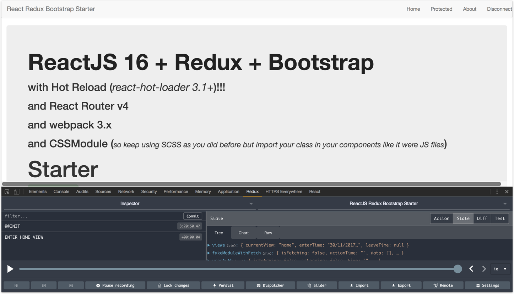

React 16.3+ React-Router 4 + Redux + Bootstrap + Webpack 4 with Hot Reload and redux-devtools-extension STARTER
==========

- *webpack is as simple as possible*
- *ReactJS is written with `optimization tricks` (stateless, pure render, PureComponent...).*
- *`pure front-end` = server independant (use whatever you want as server: NodeJS, Rails, .NET...)*
- `SPA` but `SEO` and/or `PWA` friendly since use of `dynamic imports` and `application snapshot`.

*Concept behind:* same as [react-bootstrap-webpack-starter](https://github.com/MacKentoch/react-bootstrap-webpack-starter) **but added `Redux` and amazing and helpful [redux-devtools-extension](https://github.com/zalmoxisus/redux-devtools-extension#redux-devtools-extension).**


[](https://app.fossa.io/projects/git%2Bgithub.com%2FMacKentoch%2Freact-redux-bootstrap-webpack-starter?ref=badge_shield)

## Detailed Content

**Front:**
- React JS (16.3+ - [github :link:](https://github.com/facebook/react))
- Redux (*as you application grows managing state will be a serious concern, save pain with Redux*)
- React-Redux (*Redux is not specific to ReactJS, you could easily use it with Angular2 for instance*)
- redux-devtools-extension ([github :link:](https://github.com/zalmoxisus/redux-devtools-extension#redux-devtools-extension))
- React-Router-Redux 5.x ([github :link:](https://github.com/ReactTraining/react-router/tree/master/packages/react-router-redux))
- react-router (4.x- [github :link:](https://github.com/reactjs/react-router))
- Bootstrap (3.x - [github :link:](https://github.com/twbs/bootstrap))
- React-Bootstrap ([github :link:](https://github.com/react-bootstrap/react-bootstrap))
- font-awesome ([github :link:](https://github.com/FortAwesome/Font-Awesome))
- animate.css ([github :link:](https://github.com/daneden/animate.css))
- classnames ([github :link:](https://github.com/JedWatson/classnames))
- react-motion ([github :link:](https://github.com/chenglou/react-motion))
- Webpack 4.x ([github :link:](https://github.com/webpack/webpack))
- babel 6+ ([github :link:](https://github.com/babel/babel))
- axios ([github :link:](https://github.com/mzabriskie/axios) *Why: simple, complete, isomorphic ...*)

**Tool chain:**
- babel 6+
- eslint
- webpack 4
- hot reload
- loaders
  - `js` / `jsx`
  - css
  - json
  - images formats
  - svg and fonts formats

**tests:**
- Jest
- enzyme

## Changelog

[Here](./CHANGELOG.md)

## Usage

### Install

```bash
npm install
```
### bundle dev mode (*+ redux-devtools*)

```bash
npm run dev
```

### dev : hot reload mode (*+ redux-devtools*)

```bash
npm run start
```

### tests

```bash
npm run test
```

### bundle production mode


```bash
npm run prod
```

### mini node-express server (for dev or prod bundles)

with server hot reload:
```bash
npm run serve-dev
```

without hot reload:
```bash
npm run serve-prod
```
